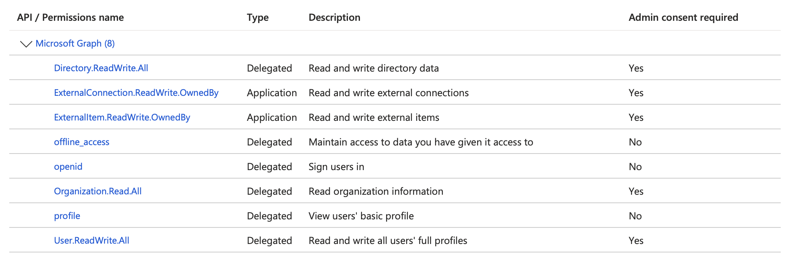

# How a CSV File Can Be the Master of Your M365 Tenant User Provisioning

> **A Learning Project**: This tool was built to explore Microsoft Graph APIs, OAuth 2.0 flows, and Graph Connectors. It works, but more importantly, it teaches. Check the [docs/](./docs/) folder for our learnings, mistakes, and solutions.

**TL;DR**: Define your users in a CSV → Run one command → Users created in Microsoft 365 with licenses assigned and profiles enriched.

```
┌─────────────────┐      ┌─────────────────┐      ┌─────────────────┐
│   agents.csv    │  →   │  npm run        │  →   │  Microsoft 365  │
│   (your data)   │      │  provision      │      │  (users ready)  │
└─────────────────┘      └─────────────────┘      └─────────────────┘
```

---

## Quick Demo: From CSV to M365 Users

### The Smallest CSV (4 columns)

This is all you need to create users:

```csv
name,email,role,department
Sarah Chen,sarah.chen@yourdomain.onmicrosoft.com,CEO,Executive
Michael Rodriguez,michael.rodriguez@yourdomain.onmicrosoft.com,CTO,Engineering
Emma Wilson,emma.wilson@yourdomain.onmicrosoft.com,Developer,Engineering
```

Run it:
```bash
npm run provision -- --csv config/my-team.csv
```

Result: 3 users created with M365 licenses, ready to use Outlook, Teams, and Office apps.

---

### The Full CSV (30+ columns with custom properties)

When you need the complete employee profile with enrichment data:

```csv
name,email,role,department,givenName,surname,jobTitle,employeeType,companyName,officeLocation,streetAddress,city,state,country,postalCode,usageLocation,preferredLanguage,mobilePhone,businessPhones,employeeId,employeeHireDate,ManagerEmail,VTeam,BenefitPlan,CostCenter,BuildingAccess,ProjectCode
Ingrid Johansen,ingrid.johansen@domain.onmicrosoft.com,CEO,Executive,Ingrid,Johansen,Chief Executive Officer,Employee,Nordic Solutions AS,Oslo HQ,Drammensveien 134,Oslo,Oslo,Norway,0277,NO,nb-NO,+47 915 12 345,"['+47 22 12 34 56']",EMP001,2015-03-15,,Executive Leadership,Executive Plus,CEO-OFFICE,Level-5,EXEC-001
Lars Hansen,lars.hansen@domain.onmicrosoft.com,CTO,Engineering,Lars,Hansen,Chief Technology Officer,Employee,Nordic Solutions AS,Oslo HQ,Drammensveien 134,Oslo,Oslo,Norway,0277,NO,nb-NO,+47 918 45 678,"['+47 22 12 34 57']",EMP002,2016-06-01,ingrid.johansen@domain.onmicrosoft.com,Executive Leadership,Executive Plus,ENG-DEPT,Level-5,ENG-000
```

**Note**: Option B ingests all 13 official people data labels plus any custom CSV columns (like `VTeam`, `BenefitPlan`, `CostCenter`) as searchable connector properties.

Run both provisioning + enrichment:
```bash
npm run provision -- --csv config/full-team.csv
npm run option-b:setup -- --csv config/full-team.csv --connection-id m365people24
```

---

## How Data Flows: CSV → Microsoft 365 Profiles

Every CSV column is automatically routed to the right destination:

```
CSV Column                    → Destination              → Copilot Searchable?
─────────────────────────────────────────────────────────────────────────────
Standard Props (name, email,  → Option A: Entra ID       → Via composite labels
 jobTitle, city, phone, etc.)    (direct user properties)

Profile API (languages,       → Option A: Profile API    → No (no labels)
 interests)                      (/profile/languages)

Labeled Props (skills,        → Option B: Connector      → Yes (people data labels)
 aboutMe, certifications,       (Path A deserialization)
 projects, awards, etc.)

Custom Props (VTeam,          → Option B: Connector      → Yes (searchable, appear
 BenefitPlan, CostCenter,       (Path B deserialization)    as "CustomPropertiesFrom
 any non-standard column)                                    Connector" note)
```

### How Custom Properties Are Detected

The tool reads your CSV header and compares each column against:
1. The [standard property schema](./src/schema/user-property-schema.ts) (50+ known Microsoft Graph properties)
2. Internal columns (`name`, `email`, `role`, `ManagerEmail`)

Any column that doesn't match either list becomes a **custom connector property** automatically. For example, if your CSV has:

```csv
name,email,department,skills,VTeam,CostCenter,ProjectCode
```

Then `VTeam`, `CostCenter`, and `ProjectCode` are auto-detected as custom properties and added to the connector schema.

### Schema Immutability

Microsoft Graph Connector schemas **cannot be updated** after registration. This means:
- The 13 official people data labels are **always** included (hardcoded)
- Custom properties are detected from your CSV **at setup time**
- If you later add new custom columns to your CSV, you must delete the old connector and create a new one:

```bash
npm run enrich:delete-connector -- --connection-id m365people24
npm run option-b:setup -- --csv config/updated.csv --connection-id m365people25
```

Re-ingestion (`npm run option-b:ingest`) works without recreating the connector — it updates existing items with new values for the same schema.

---

## What This Tool Does

| Feature | What Happens |
|---------|--------------|
| **User Creation** | Creates Entra ID accounts from CSV |
| **Multi-License Assignment** | Assigns multiple M365 licenses (E5 + Copilot, etc.) |
| **Manager Hierarchy** | Sets up reporting structure via `ManagerEmail` column |
| **Profile Enrichment** | All 13 people data labels: skills, aboutMe, certifications, awards, projects, name, position, addresses, emails, phones, and more |
| **Custom Properties** | Extra CSV columns auto-detected and added as searchable connector properties |
| **State Management** | Detects CREATE/UPDATE/NOOP - won't duplicate users |
| **Tenant Reset** | Safely delete all users except protected admin accounts |

---

## Setup (One-Time)

### 1. Azure AD App Registration

Create an app in [Azure Portal](https://portal.azure.com) → Azure Active Directory → App registrations.

**Required API Permissions:**



| Permission | Type | Purpose |
|------------|------|---------|
| `User.ReadWrite.All` | Delegated | Create and update users |
| `Directory.ReadWrite.All` | Delegated | Manage directory objects |
| `Organization.Read.All` | Delegated | Read tenant info |
| `offline_access` | Delegated | Keep tokens refreshed |
| `openid` | Delegated | Sign users in |
| `profile` | Delegated | Read user profiles |
| `ExternalConnection.ReadWrite.OwnedBy` | **Application** | Graph Connector (enrichment) |
| `ExternalItem.ReadWrite.OwnedBy` | **Application** | Graph Connector items |
| `PeopleSettings.ReadWrite.All` | **Application** | Profile source registration |

> **Important**: Click "Grant admin consent" after adding permissions!

### 2. Configure Environment

```bash
cp .env.example .env
```

Edit `.env`:
```bash
AZURE_TENANT_ID=your-tenant-id
AZURE_CLIENT_ID=your-client-id
AZURE_CLIENT_SECRET=your-client-secret  # For profile enrichment
USER_DOMAIN=yourdomain.onmicrosoft.com

# Single license
LICENSE_SKU_IDS=05e9a617-0261-4cee-bb44-138d3ef5d965

# Multiple licenses (comma-separated) - e.g., E5 + Copilot
# LICENSE_SKU_IDS=e23e2b65-8fc9-4036-a902-a17473ff6d26,639dec6b-bb19-468b-871c-c5c441c4b0cb
```

Run `npm run list-licenses` to see available licenses in your tenant.

### 3. Install & Build

```bash
npm install
npm run build
```

---

## Usage

### Basic: Create Users

```bash
# Preview what will be created (dry run)
npm run provision -- --dry-run --csv config/textcraft-europe.csv

# Actually create users
npm run provision -- --csv config/textcraft-europe.csv
```

### Advanced: Enrich Profiles with People Data

Option A (provision) must run first so Entra ID users exist before connector ingestion.

**Option A — Profile API** (languages, interests — no Copilot searchability):
```bash
npm run option-a:enrich -- --csv config/textcraft-europe.csv
```

**Option B — Graph Connector** (skills, certifications, awards, custom properties — Copilot-searchable):
```bash
# First time: creates connection + schema + ingests items
npm run option-b:setup -- --csv config/textcraft-europe.csv --connection-id m365people24

# Re-ingest only (connection already exists)
npm run option-b:ingest -- --csv config/textcraft-europe.csv --connection-id m365people24
```

The connector schema includes all 13 official people data labels plus any custom CSV columns (auto-detected). Schema cannot be updated — to add new CSV columns, delete the old connector and create a new one with a new ID.

### Monitor Ingestion Progress

Use the verification script to compare CSV totals with Microsoft Search indexing and confirm a sample item:

```bash
npm run build
node tools/debug/verify-ingestion-progress.mjs \
  --search-auth delegated \
  --connection-id m365people \
  --csv config/textcraft-europe.csv \
  --query "*"
```

Notes:
- externalItem search requires delegated auth (default scope: `ExternalItem.Read.All`).
- Use `--search-auth token` with `--search-token` to skip browser login.
- `--region` is only used for app-only search (delegated ignores it).
- Indexing can take 6+ hours before Microsoft Search/Copilot reflects updates.

### Tenant Reset: Start Fresh

Need to clean up and start over? The reset script safely removes all provisioned users while protecting admin accounts.

```bash
# Preview what will be deleted (safe - no changes made)
npm run reset-tenant

# Actually delete users (requires confirmation flag)
npm run reset-tenant:confirm
```

**Protected accounts are NEVER deleted:**
- Email patterns: `admin@*`, `administrator@*`, `root@*`, `systemadmin@*`
- Azure AD roles: Global Administrator, Security Administrator, User Administrator
- Custom exclusions configured in `.env`

**Typical workflow for fresh provisioning:**
```bash
npm run reset-tenant           # 1. Preview what will be deleted
npm run reset-tenant:confirm   # 2. Delete all non-admin users
npm run provision -- --csv config/new-users.csv  # 3. Provision new users
```

---

## CSV Column Reference

### Standard User Properties (Option A)

| Column | Required | Example | Maps To |
|--------|----------|---------|---------|
| `name` | ✅ | Sarah Chen | displayName |
| `email` | ✅ | sarah@domain.com | userPrincipalName |
| `role` | ✅ | CEO | (internal use) |
| `department` | ✅ | Executive | department |
| `givenName` | | Sarah | givenName |
| `surname` | | Chen | surname |
| `jobTitle` | | Chief Executive Officer | jobTitle |
| `employeeType` | | Employee | employeeType |
| `companyName` | | Contoso Ltd | companyName |
| `officeLocation` | | Building 1 | officeLocation |
| `city` | | Oslo | city |
| `country` | | Norway | country |
| `mobilePhone` | | +47 900 12 345 | mobilePhone |
| `ManagerEmail` | | boss@domain.com | manager (relationship) |

### Enrichment Properties (Option B - Graph Connector)

These use Microsoft people data labels and are Copilot-searchable:

| Column | Example | People data label |
|--------|---------|------------------|
| `skills` | "['TypeScript','Azure']" | `personSkills` |
| `aboutMe` | "10 years experience..." | `personNote` |
| `projects` | "['Migration']" | `personProjects` |
| `certifications` | "['PMP']" | `personCertifications` |
| `awards` | "['MVP']" | `personAwards` |
| `mySite` | "https://intranet/" | `personWebSite` |
| `birthday` | "2000-01-01" | `personAnniversaries` |

Languages/interests have no connector labels and are not ingested via the connector.

### Custom Properties (Auto-Detected from CSV)

Any CSV column that isn't a standard Microsoft Graph property or an internal column (`name`, `email`, `role`, `ManagerEmail`) is automatically treated as a **custom connector property**:

```csv
name,email,role,department,VTeam,CostCenter,BuildingAccess,WritingStyle,Specialization
Sarah Chen,sarah@domain.com,CEO,Executive,Leadership,C-SUITE,Level-5,Strategic,Leadership
```

`VTeam`, `CostCenter`, `BuildingAccess`, `WritingStyle`, `Specialization` → Automatically added to the connector schema as searchable custom properties. They appear in profile cards as notes with `displayName: "CustomPropertiesFromConnector"`.

**How it works**: The schema builder reads your CSV columns and calls `getCustomProperties(csvColumns)` to detect any column not in the [standard schema](./src/schema/user-property-schema.ts). These are registered as `string` type properties (no people data label).

**Schema limitation**: Microsoft Graph Connector schemas **cannot be updated** once registered. If you add new custom columns to your CSV, you must delete the old connector and create a new one:

```bash
# Delete old connector
npm run enrich:delete-connector -- --connection-id m365people23

# Create new connector with updated schema
npm run option-b:setup -- --csv config/updated-team.csv --connection-id m365people24
```

The 13 official people data labels (skills, certifications, awards, etc.) are always included regardless of CSV columns. Only custom properties are dynamic.

---

## Output

After provisioning, check `output/`:

```
output/
├── agents-config.json    # User IDs, passwords, all details
├── provisioning-report.md # Human-readable summary
└── passwords.txt          # Generated passwords (KEEP SECURE!)
```

---

## Project Structure

```
├── src/                    # TypeScript source
│   ├── provision.ts        # User provisioning (Option A)
│   ├── enrich-profiles.ts  # Profile enrichment (Option B)
│   ├── reset-tenant.ts     # Tenant reset with account protection
│   ├── graph-client.ts     # Microsoft Graph API client
│   ├── safety/             # Account protection modules
│   └── people-connector/   # Graph Connector modules
├── config/                 # Your CSV files go here
├── docs/                   # Deep-dive documentation
├── tools/                  # Debug & admin utilities
└── output/                 # Generated files (gitignored)
```

---

## Learnings & Documentation

This is a **learning project**. We documented everything we discovered:

| Document | What You'll Learn |
|----------|-------------------|
| [docs/ARCHITECTURE-OPTION-A-B.md](./docs/ARCHITECTURE-OPTION-A-B.md) | Why we split into two options |
| [docs/PEOPLE-DATA-AUTH-SOLUTION.md](./docs/PEOPLE-DATA-AUTH-SOLUTION.md) | Why Graph Connectors need Application permissions (we learned this the hard way) |
| [docs/STATE-MANAGEMENT.md](./docs/STATE-MANAGEMENT.md) | How we detect CREATE vs UPDATE vs NOOP |
| [docs/SETUP.md](./docs/SETUP.md) | Detailed Azure AD setup guide |
| [docs/USAGE.md](./docs/USAGE.md) | Complete usage reference |

**Key Learnings:**

1. **Delegated vs Application permissions matter** - Graph Connectors only work with Client Credentials Flow
2. **Profile source registration is critical** - Without it, data won't appear in `/me/profile` API or profile cards
3. **Profile prioritization requires beta API** - Use `PATCH /admin/people/profilePropertySettings/{id}` (not the collection endpoint)
4. **Schema provisioning is slow** - Wait 10+ minutes after creating a connection
5. **Schema cannot be updated** - Once registered, you must delete and recreate the connection to change schema
6. **Items aren't instantly searchable** - Expect 6+ hours for Microsoft Search/Copilot indexing
7. **Profile data propagation takes time** - Allow 1-24 hours for data to appear in profile API
8. **State management prevents duplicates** - CSV is idempotent; run it as many times as you want

---

## Commands Reference

```bash
# Provisioning
npm run provision                      # Create users from CSV
npm run provision -- --dry-run         # Preview only (no changes)
npm run provision -- --csv config/myfile.csv  # Use specific CSV

# License Management
npm run list-licenses                  # Show available licenses
npm run update-licenses                # Add missing licenses to users
npm run update-licenses -- --csv config/myfile.csv  # Update licenses for specific CSV
npm run update-licenses -- --dry-run   # Preview license changes

# Tenant Management
npm run reset-tenant                   # Preview users to delete (dry run)
npm run reset-tenant:confirm           # Actually delete all non-admin users
npm run list-users                     # List all users in tenant

# Option A: Profile API Enrichment (languages, interests)
npm run option-a:enrich                # Enrich via Profile API
npm run option-a:enrich:dry-run        # Preview Profile API enrichment

# Option B: Graph Connector (skills, certs, awards, custom props — Copilot-searchable)
npm run option-b:setup                 # Create connection + schema + ingest
npm run option-b:ingest                # Re-ingest items (connection must exist)
npm run option-b:dry-run               # Preview connector enrichment
npm run enrich:delete-connector        # Delete connector connection

# Ingestion Verification
node tools/debug/verify-ingestion-progress.mjs --search-auth delegated --connection-id m365people --csv config/textcraft-europe.csv --query "*"

# Debug & Diagnostics
npm run debug:checklist -- --tenant-id <TENANT_ID> --connection-id <CONNECTION_ID>

# Utilities
npm run logout                         # Clear cached auth tokens
npm run test-connection                # Verify Graph API access
npm run build                          # Compile TypeScript
```

Debug workflow references: [docs/DEBUG-PLAYBOOK.md](docs/DEBUG-PLAYBOOK.md) and [debug/README.md](debug/README.md)

---

## License

MIT

---

## Contributing

This is a learning project! Found something interesting? Learned something new? Open a PR to share your findings.
